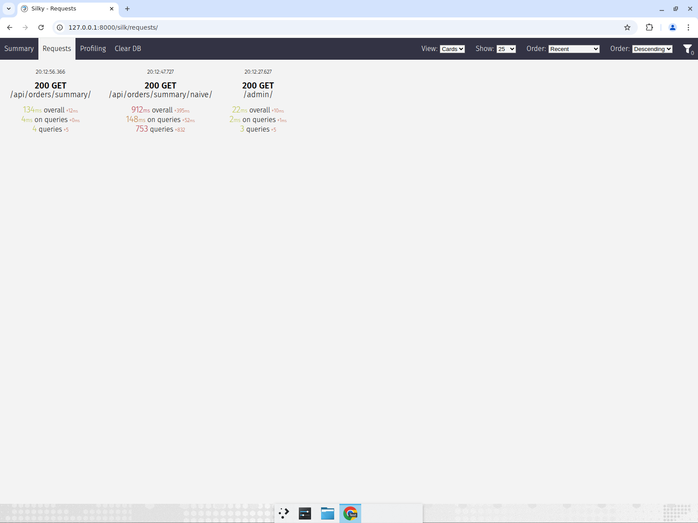
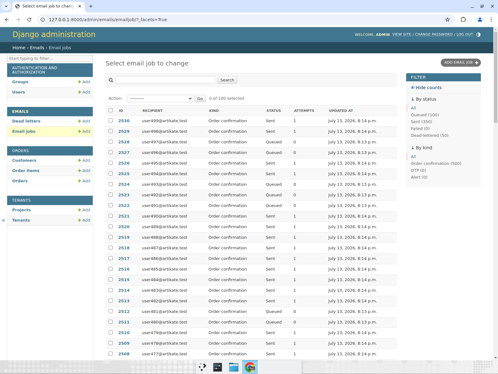
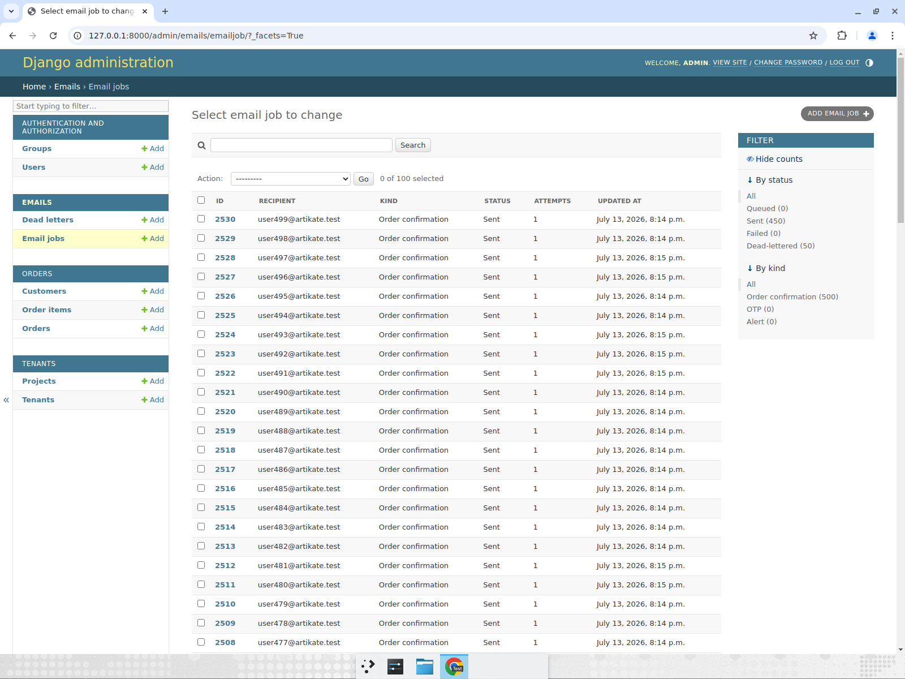
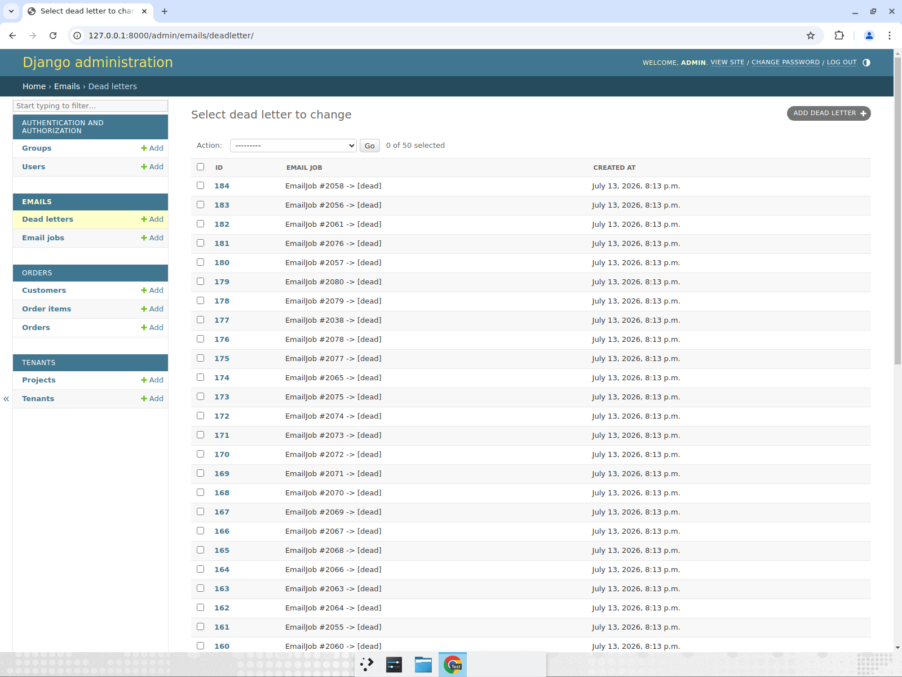
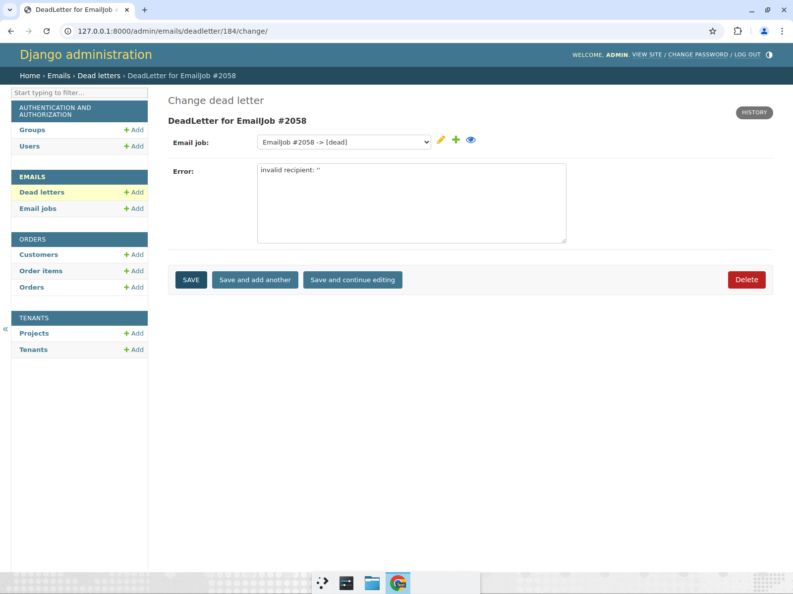
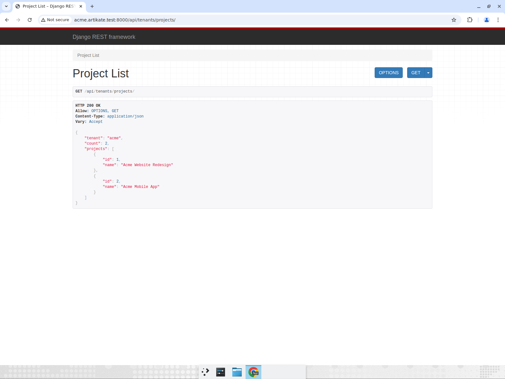
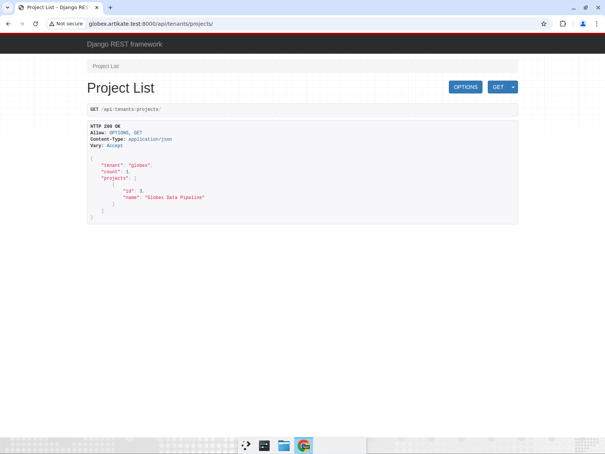
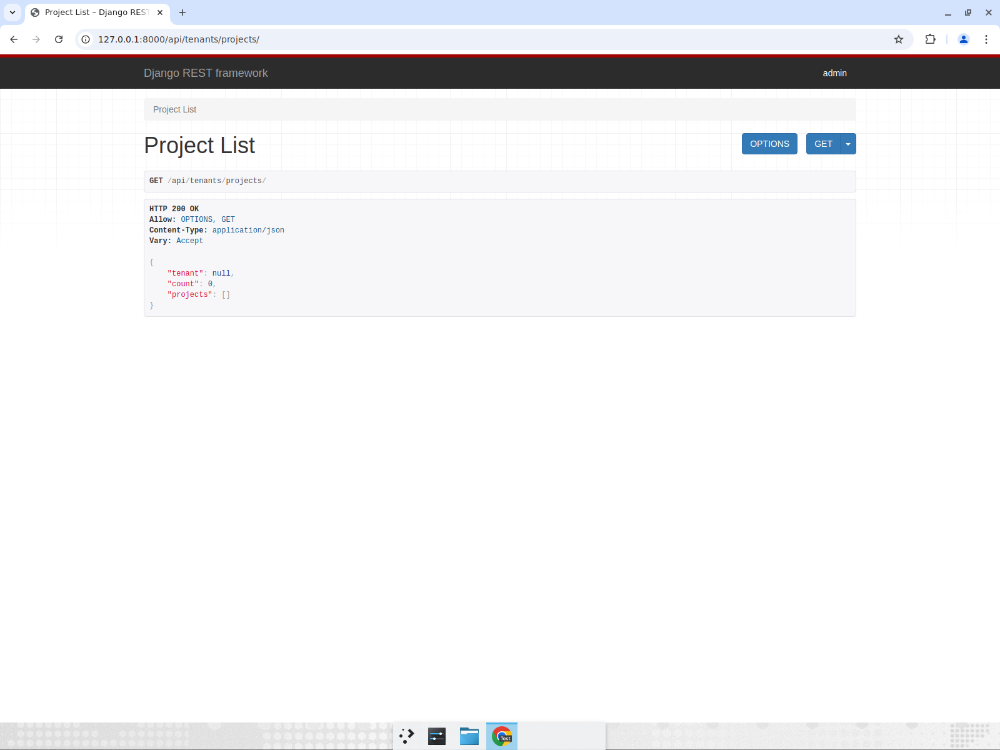

# Test report — Artikate backend

Manual end-to-end run plus the automated suite. Screenshots below are from the
recorded demo; the images live next to this file in `docs/report/`.

**Environment:** Python 3.10, Django 5.0, DRF 3.17, Celery 5.6 (8 workers),
Redis 6, django-silk 5.5, SQLite.

## Summary

| Section | What was checked | Result |
|---|---|---|
| 1 — N+1 | Silk query counts, naive vs optimized orders endpoint | PASS |
| 2 — Queue | 500 jobs drain under a hard 200/min cap, retries, dead-letter, no loss | PASS |
| 3 — Tenants | Per-tenant query scoping, fails closed with no tenant | PASS |
| Automated | `manage.py check`, pyflakes, `manage.py test` | PASS (21 tests) |

## Automated checks

```
$ python manage.py check
System check identified no issues (0 silenced).

$ python -m pyflakes orders emails tenants config
(clean)

$ python manage.py test
Ran 21 tests in 1.010s
OK
```

The suite includes the required 500-job queue test (no loss, rate respected,
an intentional transient failure retries and succeeds) and the tenant negative
tests (A can't read B by filter or pk, `.all()` doesn't bypass scoping).

---

## Section 1 — N+1 on the orders summary endpoint

Hit the naive endpoint and the optimized one, then compared them in Silk.

- `/api/orders/summary/naive/` — **753 queries, 912 ms**
- `/api/orders/summary/` — **4 queries, 134 ms**

Same 250-order payload; the fix is `select_related("customer")` +
`prefetch_related("items")` with `only(...)` on the item columns.



**Result: PASS** — the 1 + 2N query pattern collapses to a constant handful.

---

## Section 2 — Email queue (Celery + Redis)

Submitted 500 jobs with 10% intentionally invalid recipients
(`submit_emails --count 500 --fail-rate 0.1`) and watched the admin drain them.
The limiter is a Redis sliding-window log, so no rolling 60s window exceeds 200.

**First window** — exactly 200 processed (150 sent + 50 dead), 300 throttled and
left queued:


**Second window** — Sent climbs to 350 (+200), Queued down to 100. `Attempts = 1`
on the newly-sent rows shows they were rescheduled, not dropped:



**Fully drained** — Sent 450, Dead-lettered 50, Queued 0. All 500 accounted for:



**Dead-letter table** — the 50 permanent failures land here for inspection/replay:



Each dead letter stores the reason (here, an invalid recipient):



Post-run tallies from the DB:

```
email totals: {'sent': 450, 'dead': 50}   dead_letters: 50   total jobs: 500
sent jobs that needed >=1 retry attempt: 450
max SENT in any 60s window (by DB save time): 200
```

**Result: PASS** — nothing lost (450 + 50 = 500, queued 0), the hard 200/min cap
holds, and rate-limited jobs are rescheduled rather than dropped.

> Note: this exercised a real bug found while recording. An earlier version
> capped rate-limit retries, so a backlog exhausted the cap and ~300 jobs got
> stuck/lost. The task is now `max_retries=None` (throttling is flow control,
> not failure); provider errors stay bounded to `MAX_RETRIES=5` and dead-letter.
> Also switched from a token bucket (which let a live 60s window hit 219) to the
> sliding-window log for a true "≤ N per rolling minute".

---

## Section 3 — Multi-tenant isolation

Same endpoint (`/api/tenants/projects/`), tenant resolved from the subdomain.

**acme** → only its own 2 projects:



**globex** → only its own 1 project, none of acme's:



**no tenant** (plain `127.0.0.1`) → `count: 0`, fails closed:



**Result: PASS** — every query is scoped to the request's tenant, and a missing
tenant returns nothing instead of leaking rows.
