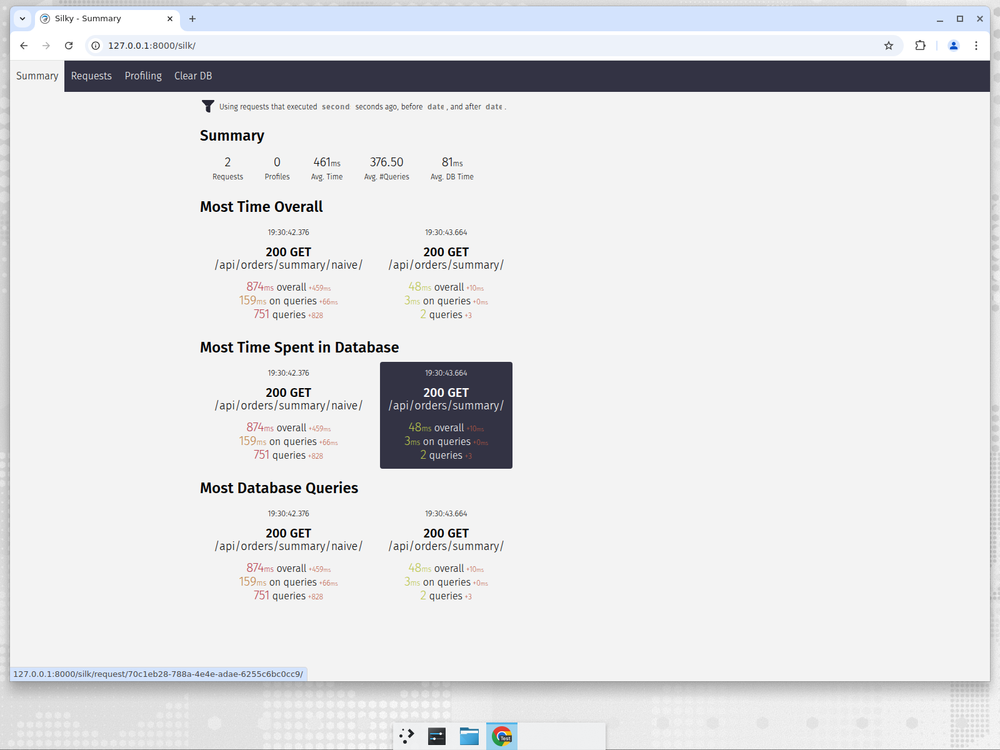
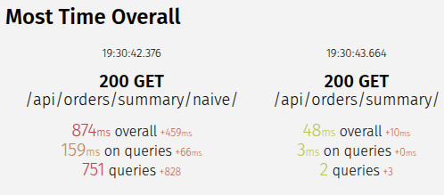

# Section 1 — django-silk query-count evidence (before/after)

Captured with a seeded customer of **250 orders × 3 items** (`python manage.py
seed_orders --orders 250 --items 3`) and django-silk enabled
(`SILKY_PYTHON_PROFILER = True`). Profiler data is viewable live at `/silk/`.

## Result

| Endpoint | SQL queries | Server time |
| --- | --- | --- |
| `GET /api/orders/summary/naive/?customer_id=1` (before) | **751** | ~874 ms |
| `GET /api/orders/summary/?customer_id=1` (after) | **2** | ~48 ms |

`curl` wall-clock time for the same requests: **1.29 s → 0.06 s**.

## Why 751 queries

For N = 250 orders, the naive path issues:

- `1` query for the orders themselves, plus per order:
  - `1` for `order.customer` (serializer `customer_name`),
  - `1` for `order.items` in `get_item_count`,
  - `1` for `order.items` again in `get_total_cents`.

= `1 + 3N` = `1 + 750` = **751**. The query count grows linearly with order
count, which is why users with 200+ orders hit the 30s timeout after the deploy.

## Why 2 queries after the fix

`select_related("customer")` folds the customer into the initial JOIN (0 extra),
and `prefetch_related("items")` fetches every item in a single
`... WHERE order_id IN (…)` query. Total = **2**, constant regardless of N.
The serializer reads `order.items.all()` from the prefetch cache, so the second
access adds no query.

See `ANSWERS.md` §1 for the full investigation log and DB/ORM explanation, and
`orders/tests.py` for the automated query-count assertions.
